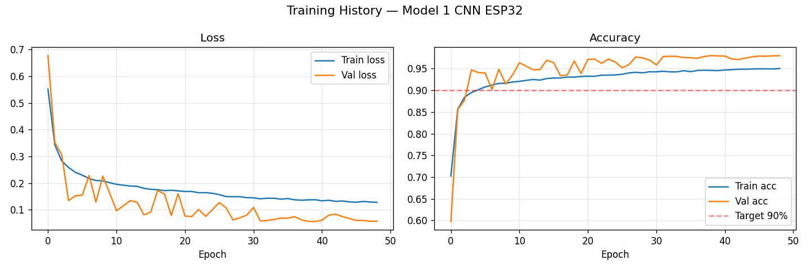
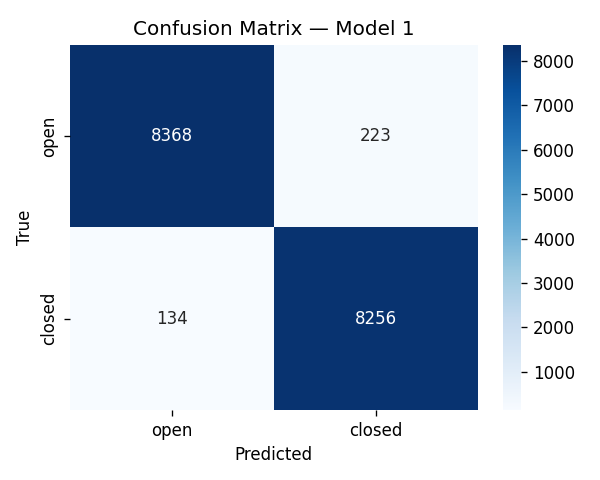
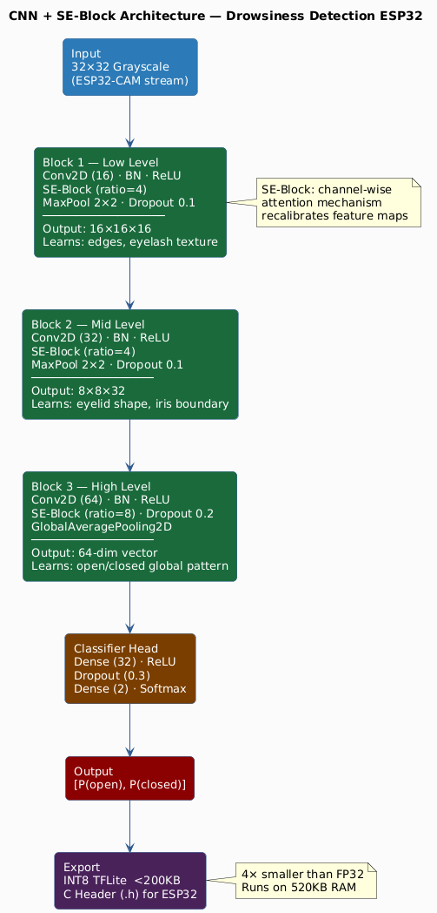
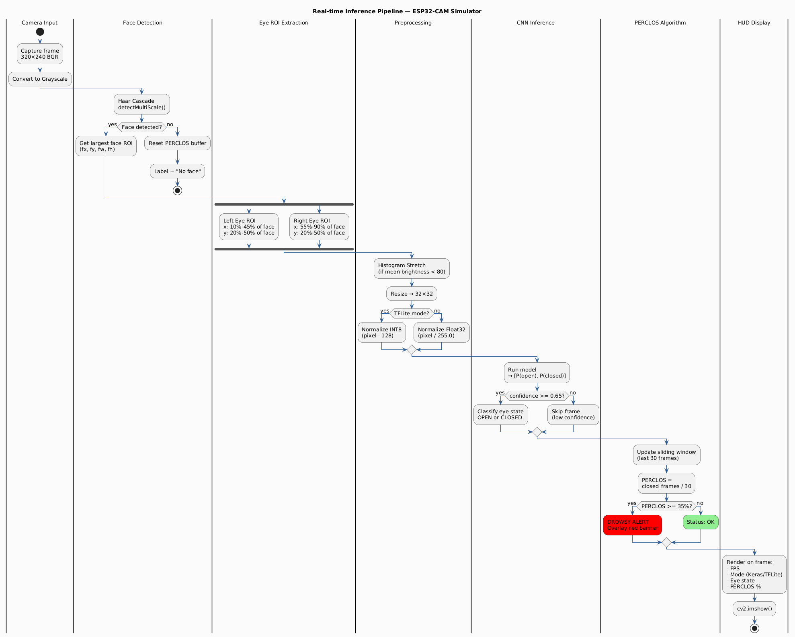

# Drowsiness Detection for ESP32-CAM


Real-time driver drowsiness detection using PERCLOS algorithm and a custom CNN + SE-block architecture, optimized and exported as INT8 TFLite for deployment on ESP32-CAM embedded devices.

---

## Highlights

- **Custom CNN + Squeeze-and-Excitation block** — lightweight architecture designed for microcontroller constraints
- **INT8 Quantization** — 4× model size reduction, runs on ESP32-CAM with < 200KB RAM
- **PERCLOS-based alert** — sliding window (30 frames, threshold 35%) instead of single-frame prediction, drastically reducing false alarms
- **Dual eye ROI tracking** — detects drowsiness even when one eye is partially occluded
- **Simulates full ESP32-CAM pipeline** — 320×240, grayscale, IR night-vision conditions

---

## Results

| Metric | Value |
|--------|-------|
| Val Accuracy | **97%** |
| Recall \[closed eye\] | **98.4%** |
| False Alarm Rate | **2.6%** |
| Model Size (INT8) | **< 200 KB** |
| Target Device | ESP32-CAM |
| Dataset | MRL Eye Dataset |

>  **Recall [closed]** is the most critical safety metric — missing a closed eye is far more dangerous than a false alarm. At 98.4%, this model exceeds the 90% safety target.

---

## Training Results

### Training History



Val accuracy exceeded the **90% target from epoch 5**, demonstrating fast convergence with a lightweight architecture. Val loss consistently lower than train loss indicates strong generalization without overfitting.

### Confusion Matrix



---

## Architecture


---

##  Real-time Inference Pipeline

---


## Quick Start

### Option 1: Run locally

```bash
# Clone repo
git clone https://github.com/sonplusplus/Drowsiness-Detection-ESP32
cd drowsiness-detection-esp32

# Install dependencies
pip install ai-edge-litert==1.0.1

# Run with TFLite INT8 model (recommended)
python inference/test.py --tflite models/eye_model_int8.tflite

# Or run with Keras model
python inference/test.py --model models/best_model_m1.keras
```

### Option 2: Docker

```bash
# Build
docker build -t drowsiness-esp32 .

# Run (Linux — pass camera device)
docker run --device=/dev/video0 drowsiness-esp32

# Run (Windows/Mac — use camera index)
docker run drowsiness-esp32 python inference/test.py --cam 0
```

### Keyboard shortcuts while running:
| Key | Action |
|-----|--------|
| `Q` | Quit |
| `S` | Save screenshot |

---

## Training (Kaggle)

All dependencies are pre-installed on Kaggle except:

```bash
pip install ai-edge-litert==1.0.1
```

1. Upload `training/cnn2d.ipynb` to [Kaggle](https://kaggle.com)
2. Add dataset: **MRL Eye Dataset** (`akashshingha850/mrl-eye-dataset`)
3. Enable GPU accelerator
4. Run all cells → model exports automatically to:
   - `eye_model_int8.tflite`
   - `eye_model.h` (C header for ESP32)

---

## Dataset & Preprocessing

**Dataset:** [MRL Eye Dataset](https://kaggle.com/datasets/akashshingha850/mrl-eye-dataset) — 84,898 eye images (awake/sleepy)

**Augmentation pipeline** (train set only):
- Random horizontal flip
- Random brightness ± 0.35
- Random contrast 0.6–1.4
- Gaussian noise (σ = 0.04)
- Random Gaussian blur (30% probability)
- Random erasing (25% probability) — simulates glasses/hand occlusion

**IR night simulation:**
- Darken image (factor 0.2–0.5)
- Add sensor noise
- Apply CLAHE enhancement

---

## ESP32-CAM Deployment

The INT8 TFLite model is designed for ESP32-CAM constraints:
- Model size < 200KB
- Input size : 32x32 grayscale
- Quantization : INT8

Flash `firmware/eye_detector.ino` via Arduino IDE with:
- Board: **AI Thinker ESP32-CAM**
- Include: `eye_model.h` (auto-generated by training notebook)

---

## PERCLOS

Single-frame prediction is unreliable — blinking looks identical to drowsiness. **PERCLOS** (Percentage of Eye Closure) measures the proportion of time eyes are closed over a rolling window:

```
PERCLOS = closed_frames / total_frames (last 30 frames)
Alert triggered when PERCLOS ≥ 35%
```

This approach matches the standard used in clinical driver monitoring research, reducing false alarms while catching genuine fatigue patterns.

---

## Requirements

```txt
# Not pre-installed — must install manually
ai-edge-litert==1.0.1

# For Docker/server (headless, no GUI dependency)
opencv-python-headless==4.9.0.80
```

> All other dependencies (TensorFlow, NumPy, OpenCV, scikit-learn) are pre-installed on Kaggle and most Python environments.

---

